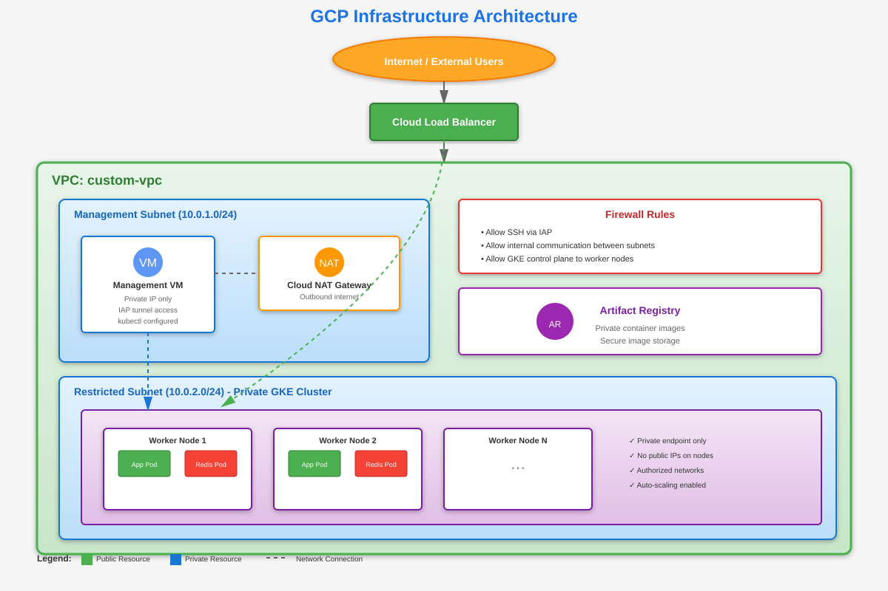

# 🚀 GCP Infrastructure with Terraform & Kubernetes

[](https://www.terraform.io/)
[](https://cloud.google.com/)
[](https://kubernetes.io/)

A production-ready Google Cloud Platform infrastructure provisioned with Terraform, featuring a **private GKE cluster**, secure networking, and automated Kubernetes deployments.

## Architecture Diagram

<p align="center">
  
</p>
## 📋 Table of Contents

- [Overview](#overview)
- [Architecture](#architecture)
- [Infrastructure Components](#infrastructure-components)
- [Prerequisites](#prerequisites)
- [Quick Start](#quick-start)
- [Detailed Setup](#detailed-setup)
- [Kubernetes Deployment](#kubernetes-deployment)
- [Configuration](#configuration)
- [Security Features](#security-features)
- [Troubleshooting](#troubleshooting)
- [Clean Up](#clean-up)
- [Future Improvements](#future-improvements)
- [Contributing](#contributing)

## 🎯 Overview

This project provides a complete, secure GCP environment using Infrastructure as Code (IaC) principles. The infrastructure includes:

- **Private GKE Cluster** with isolated nodes
- **Custom VPC** with segmented subnets
- **Management VM** for secure cluster operations
- **Cloud NAT** for outbound internet access
- **IAM** configurations following least-privilege principles
- **Sample Kubernetes application** with Redis backend

## 🏗️ Architecture

### High-Level Architecture

```
                                    ┌─────────────────────────────────────┐
                                    │      Internet / External Users       │
                                    └──────────────┬──────────────────────┘
                                                   │
                                    ┌──────────────▼──────────────────────┐
                                    │      Cloud Load Balancer (Ingress)   │
                                    └──────────────┬──────────────────────┘
                                                   │
┌───────────────────────────────────────────────────────────────────────────────┐
│                             VPC: custom-vpc                                    │
│                                                                                │
│  ┌─────────────────────────────────────────────────────────────────────────┐ │
│  │  Management Subnet (10.0.1.0/24)                                         │ │
│  │                                                                           │ │
│  │  ┌────────────────────────────┐          ┌──────────────────────────┐   │ │
│  │  │   Management VM             │          │   Cloud NAT Gateway      │   │ │
│  │  │   - Private IP only         │◄────────►│   - Outbound internet    │   │ │
│  │  │   - IAP tunnel access       │          │   - No inbound access    │   │ │
│  │  │   - kubectl configured      │          └──────────────────────────┘   │ │
│  │  └────────────────────────────┘                                          │ │
│  └─────────────────────────────────────────────────────────────────────────┘ │
│                                                                                │
│  ┌─────────────────────────────────────────────────────────────────────────┐ │
│  │  Restricted Subnet (10.0.2.0/24)                                         │ │
│  │                                                                           │ │
│  │  ┌─────────────────────────────────────────────────────────────────┐    │ │
│  │  │              Private GKE Cluster                                 │    │ │
│  │  │                                                                  │    │ │
│  │  │  ┌──────────────────┐  ┌──────────────────┐  ┌──────────────┐ │    │ │
│  │  │  │   Worker Node 1   │  │   Worker Node 2   │  │  Worker Node │ │    │ │
│  │  │  │                   │  │                   │  │      ...      │ │    │ │
│  │  │  │  ┌────────────┐  │  │  ┌────────────┐  │  │               │ │    │ │
│  │  │  │  │ App Pods   │  │  │  │ App Pods   │  │  │               │ │    │ │
│  │  │  │  └────────────┘  │  │  └────────────┘  │  │               │ │    │ │
│  │  │  │  ┌────────────┐  │  │  ┌────────────┐  │  │               │ │    │ │
│  │  │  │  │ Redis Pods │  │  │  │ Redis Pods │  │  │               │ │    │ │
│  │  │  │  └────────────┘  │  │  └────────────┘  │  │               │ │    │ │
│  │  │  └──────────────────┘  └──────────────────┘  └──────────────┘ │    │ │
│  │  │                                                                  │    │ │
│  │  │  - Private endpoint only                                        │    │ │
│  │  │  - No public IPs on nodes                                       │    │ │
│  │  │  - Authorized networks configured                               │    │ │
│  │  └─────────────────────────────────────────────────────────────────┘    │ │
│  └─────────────────────────────────────────────────────────────────────────┘ │
│                                                                                │
│  ┌─────────────────────────────────────────────────────────────────────────┐ │
│  │                          Firewall Rules                                  │ │
│  │  • Allow SSH via IAP                                                     │ │
│  │  • Allow internal communication between subnets                          │ │
│  │  • Allow GKE control plane to worker nodes                               │ │
│  └─────────────────────────────────────────────────────────────────────────┘ │
└───────────────────────────────────────────────────────────────────────────────┘

                    ┌──────────────────────────────────────┐
                    │      Artifact Registry               │
                    │  - Private container images          │
                    └──────────────────────────────────────┘
```

### Network Flow Diagram

```
┌──────────────┐         ┌──────────────┐         ┌──────────────┐
│   Admin      │         │  Management  │         │ GKE Cluster  │
│   User       │         │     VM       │         │   Nodes      │
└──────┬───────┘         └──────┬───────┘         └──────┬───────┘
       │                        │                         │
       │ 1. IAP Tunnel          │                         │
       │ (gcloud ssh)           │                         │
       ├───────────────────────►│                         │
       │                        │                         │
       │                        │ 2. kubectl commands     │
       │                        │ (via private endpoint)  │
       │                        ├────────────────────────►│
       │                        │                         │
       │                        │                         │ 3. Outbound
       │                        │                         │ (via Cloud NAT)
       │                        │                         ├─────────────►
       │                        │                         │  Internet
       │                        │ 4. Container pulls      │
       │                        │ (Artifact Registry)     │
       │                        │◄────────────────────────┤
```

## 🧩 Infrastructure Components

### Networking (`Network.tf`)

| Resource | Description |
|----------|-------------|
| **VPC** | Custom Virtual Private Cloud with global routing |
| **Management Subnet** | `10.0.1.0/24` - Hosts management VM |
| **Restricted Subnet** | `10.0.2.0/24` - Hosts GKE cluster nodes |
| **Cloud Router** | Enables Cloud NAT for private resources |
| **Cloud NAT** | Provides outbound internet access without public IPs |
| **Firewall Rules** | Secure access controls and internal communication |

### Compute Resources

| Component | File | Description |
|-----------|------|-------------|
| **Management VM** | `management_vm.tf` | Private VM for cluster operations and testing |
| **GKE Cluster** | `gke.tf` | Private Kubernetes cluster with configurable node pool |
| **Node Pool** | `gke.tf` | Auto-scaling worker nodes for workload execution |

### Security & IAM (`iam.tf`)

- **Service Accounts** with least-privilege access
- **IAM Role Bindings** for GKE and VM operations
- **Workload Identity** support (optional)
- **Private cluster** with no public endpoints

### Kubernetes Resources (`K8s/`)

```
K8s/
├── namespace.yaml              # Production namespace
├── configmap.yaml              # Application configuration
├── codemaster-deployment.yaml  # Main application deployment
├── redis-deployment.yaml       # Redis cache deployment
└── ingress.yaml                # External load balancer
```

## 📦 Prerequisites

Before you begin, ensure you have:

- **GCP Account** with billing enabled
- **GCP Project** created
- **Terraform** >= 1.7.0 installed
- **gcloud CLI** installed and authenticated
- **kubectl** installed
- **Appropriate IAM permissions**:
  - `roles/compute.admin`
  - `roles/container.admin`
  - `roles/iam.serviceAccountAdmin`
  - `roles/resourcemanager.projectIamAdmin`

## 🚀 Quick Start

```bash
# 1. Authenticate with GCP
gcloud auth login
gcloud auth application-default login

# 2. Clone the repository
git clone https://github.com/Abdalrahman-Bebars/GCP-Infrastructure.git
cd GCP-Infrastructure

# 3. Initialize Terraform
terraform init

# 4. Review and customize terraform.tfvars
# Edit variables like project_id, region, admin_user_email, etc.

# 5. Plan the infrastructure
terraform validate
terraform plan -out=tfplan

# 6. Apply the configuration
terraform apply tfplan

# 7. Configure kubectl (from management VM - see detailed steps below)
```

## 📖 Detailed Setup

### Step 1: Authentication

```bash
# Authenticate with your GCP account
gcloud auth login

# Set up Application Default Credentials for Terraform
gcloud auth application-default login

# Optional: Use service account key
# export GOOGLE_APPLICATION_CREDENTIALS=/path/to/terraform-key.json
```

### Step 2: Configure Variables

Edit `terraform.tfvars` with your specific values:

```hcl
project_id              = "your-gcp-project-id"
region                  = "us-central1"
zone                    = "us-central1-a"
management_subnet_cidr  = "10.0.1.0/24"
restricted_subnet_cidr  = "10.0.2.0/24"
gke_node_count         = 2
admin_user_email       = "your-email@example.com"
admin_public_ip        = "YOUR_PUBLIC_IP/32"
```

### Step 3: Deploy Infrastructure

```bash
# Initialize Terraform (downloads providers and modules)
terraform init

# Validate configuration syntax
terraform validate

# Preview changes
terraform plan -out=tfplan

# Apply infrastructure changes
terraform apply tfplan
```

**Expected deployment time**: 10-15 minutes

### Step 4: Access Management VM

The management VM is **private** and can only be accessed via Identity-Aware Proxy (IAP):

```bash
# SSH into management VM using IAP tunnel
gcloud compute ssh management-vm \
  --project YOUR_PROJECT_ID \
  --zone us-central1-a \
  --tunnel-through-iap
```

### Step 5: Configure kubectl

From **inside the management VM**:

```bash
# Get GKE cluster credentials
gcloud container clusters get-credentials private-gke-cluster \
  --region us-central1 \
  --project YOUR_PROJECT_ID

# Verify connection
kubectl get nodes
kubectl cluster-info
```

## ☸️ Kubernetes Deployment

### Deploy Sample Application

From the management VM or any machine with kubectl configured:

```bash
# Apply all Kubernetes manifests
kubectl apply -f K8s/

# Verify deployments
kubectl get all -n production

# Check pod status
kubectl get pods -n production -w
```

### Application Components

| Component | Type | Description |
|-----------|------|-------------|
| **Namespace** | `production` | Isolates application resources |
| **ConfigMap** | Configuration | Application settings and environment variables |
| **Codemaster App** | Deployment + Service | Main application with load balancer |
| **Redis** | Deployment + Service | Cache and session storage |
| **Ingress** | Load Balancer | External HTTPS access |

### Access the Application

```bash
# Get the external IP of the ingress
kubectl get ingress -n production

# Wait for the IP to be assigned (may take 5-10 minutes)
# Access your application at: http://<EXTERNAL_IP>
```

## ⚙️ Configuration

### Key Variables

| Variable | Description | Default |
|----------|-------------|---------|
| `project_id` | GCP project ID | *Required* |
| `region` | GCP region | `us-central1` |
| `zone` | GCP zone | `us-central1-a` |
| `management_subnet_cidr` | CIDR for management subnet | `10.0.1.0/24` |
| `restricted_subnet_cidr` | CIDR for GKE subnet | `10.0.2.0/24` |
| `gke_node_count` | Initial number of GKE nodes | `2` |
| `admin_user_email` | Admin email for IAM | *Required* |
| `admin_public_ip` | Your public IP for authorized networks | *Required* |

### Terraform State Management

**⚠️ Important**: Terraform state files contain sensitive information.

**Current setup** (local state):
- State stored in `terraform.tfstate`
- Backup in `terraform.tfstate.backup`
- **Do NOT commit these files to Git**

**Recommended** (remote state):

```hcl
# Add to provider.tf
terraform {
  backend "gcs" {
    bucket = "your-terraform-state-bucket"
    prefix = "terraform/state"
  }
}
```

## 🔒 Security Features

### Network Security

✅ **Private GKE Cluster**
- No public IP addresses on nodes
- Private control plane endpoint
- Authorized networks for API access

✅ **Network Isolation**
- Segmented subnets for different workload types
- Firewall rules enforcing least-privilege access
- Cloud NAT for controlled outbound traffic

✅ **Secure Access**
- IAP tunnel for SSH access (no direct internet exposure)
- No SSH keys in metadata
- Service accounts with minimal permissions

### IAM & Authentication

✅ **Service Accounts**
- Dedicated service accounts per component
- Role-based access control (RBAC)
- No overly permissive roles

✅ **Workload Identity** (optional)
- Kubernetes pods can assume GCP service account identities
- No need for static credentials

### Best Practices Implemented

- ✅ Private cluster with no public endpoints
- ✅ Least-privilege IAM policies
- ✅ Network segmentation
- ✅ Encrypted communication
- ✅ Regular security updates via node auto-upgrade
- ✅ Resource quotas and limits

## 🔧 Troubleshooting

### Issue: Cannot connect to GKE cluster

**Solution**: Ensure you're accessing from the management VM or your IP is in authorized networks.

```bash
# Verify authorized networks
gcloud container clusters describe private-gke-cluster \
  --region us-central1 \
  --format="get(masterAuthorizedNetworksConfig)"
```

### Issue: Terraform destroy hangs on GKE deletion

**Solution**: Manually delete instance groups first.

```bash
# List instance groups
gcloud compute instance-groups managed list

# Delete stuck instance groups
gcloud compute instance-groups managed delete <group-name> \
  --zone=<zone> \
  --quiet
```

### Issue: Pods can't pull images

**Solution**: Verify Artifact Registry access and service account permissions.

```bash
# Check node service account
kubectl get nodes -o jsonpath='{.items[0].spec.providerID}' | grep serviceAccount

# Verify IAM roles
gcloud projects get-iam-policy YOUR_PROJECT_ID \
  --flatten="bindings[].members" \
  --filter="bindings.members:serviceAccount*"
```

### Issue: Management VM cannot access GKE

**Solution**: Check firewall rules and service account roles.

```bash
# Test connectivity
gcloud compute ssh management-vm --tunnel-through-iap \
  --command="kubectl get nodes"
```

## 🧹 Clean Up

To destroy all resources:

```bash
# Destroy all Terraform-managed resources
terraform destroy

# Confirm by typing 'yes'
```

**Note**: Some resources may require manual cleanup:

```bash
# List and delete load balancers created by Kubernetes
kubectl delete ingress --all -n production
kubectl delete service --all -n production

# Wait a few minutes, then run terraform destroy again
terraform destroy
```

## 🚀 Future Improvements

### Infrastructure

- [ ] Implement Terraform modules for better organization
- [ ] Add remote state backend (GCS) with state locking
- [ ] Implement multi-region deployment
- [ ] Add VPN or Interconnect for hybrid connectivity
- [ ] Integrate Cloud Armor for DDoS protection

### CI/CD

- [ ] GitHub Actions workflow for Terraform validation
- [ ] Automated `terraform fmt` checks
- [ ] Pull request plans with cost estimation
- [ ] Automated Kubernetes manifest validation
- [ ] Integration tests post-deployment

### Monitoring & Observability

- [ ] Cloud Monitoring dashboards
- [ ] Cloud Logging integration
- [ ] Alerting policies
- [ ] SLO/SLA monitoring
- [ ] Cost tracking and optimization

### Security

- [ ] Implement Workload Identity Federation
- [ ] Add Binary Authorization for container signing
- [ ] Integrate Secret Manager for credentials
- [ ] Enable GKE security posture dashboard
- [ ] Implement Pod Security Standards

### Application

- [ ] Helm charts for application deployment
- [ ] GitOps with ArgoCD or Flux
- [ ] Horizontal Pod Autoscaling
- [ ] Database integration (Cloud SQL)
- [ ] Redis persistence configuration

## 📄 License

This project is open source and available under the [MIT License](LICENSE).

## 👤 Author

**Abdalrahman Bebars**

- GitHub: [@Abdalrahman-Bebars](https://github.com/Abdalrahman-Bebars)

## 🤝 Contributing

Contributions, issues, and feature requests are welcome!

1. Fork the repository
2. Create your feature branch (`git checkout -b feature/amazing-feature`)
3. Commit your changes (`git commit -m 'Add some amazing feature'`)
4. Push to the branch (`git push origin feature/amazing-feature`)
5. Open a Pull Request

---

## 📚 Additional Resources

- [Terraform GCP Provider Documentation](https://registry.terraform.io/providers/hashicorp/google/latest/docs)
- [GKE Best Practices](https://cloud.google.com/kubernetes-engine/docs/best-practices)
- [GCP Security Best Practices](https://cloud.google.com/security/best-practices)
- [Kubernetes Documentation](https://kubernetes.io/docs/home/)

---

**⭐ If you find this project helpful, please consider giving it a star!**